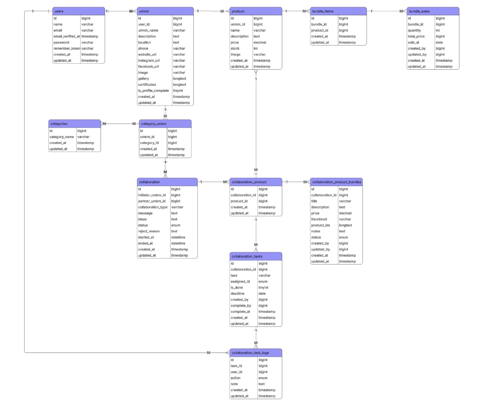

# Hubungan Antar Tabel UMGrow

| Hubungan                                      | Tipe Relasi   | Deskripsi        2                                |
| --------------------------------------------- | ------------- | ------------------------------------------------ |
| users → umkm                                  | 1 : 1         | Satu user hanya bisa memiliki satu UMKM          |
| umkm → product                                | 1 : N         | Satu UMKM punya banyak produk                    |
| umkm ↔ categories                             | M : N         | UMKM bisa masuk ke banyak kategori               |
| umkm ↔ collaboration                          | 1 : N (ganda) | UMKM bisa jadi inisiator dan partner kolaborasi  |
| collaboration → collaboration_product         | 1 : N         | Satu kolaborasi bisa melibatkan banyak produk    |
| collaboration → collaboration_tasks           | 1 : N         | Satu kolaborasi punya banyak tugas               |
| collaboration_tasks → collaboration_task_logs | 1 : N         | Setiap tugas punya banyak log                    |
| collaboration → collaboration_product_bundles | 1 : N         | Satu kolaborasi bisa hasilkan beberapa bundling  |
| product → bundle_items                        | 1 : N         | Produk bisa masuk ke beberapa bundling           |
| bundle_items → bundle_sales                   | N : 1         | Item bundling tercatat dalam transaksi penjualan |

